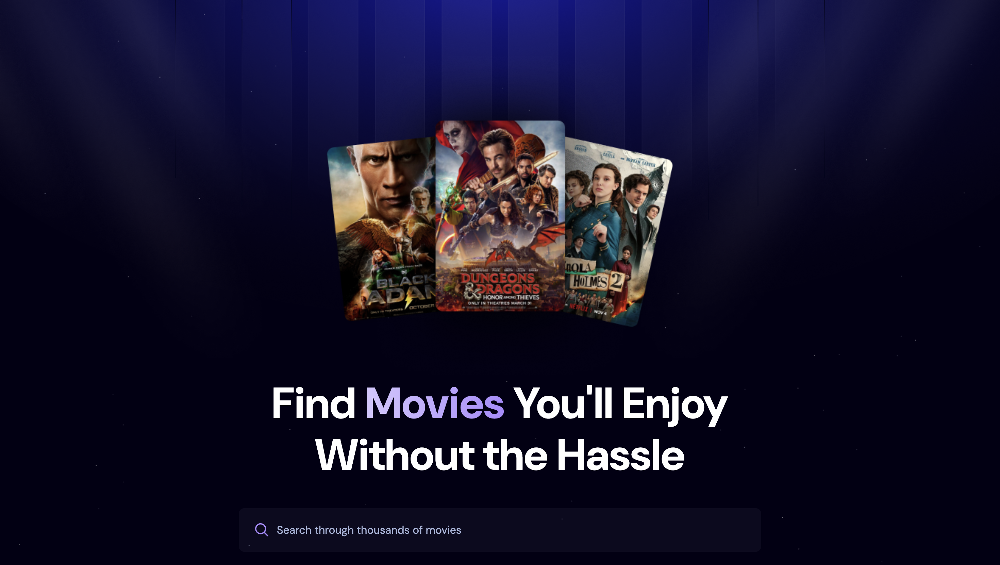
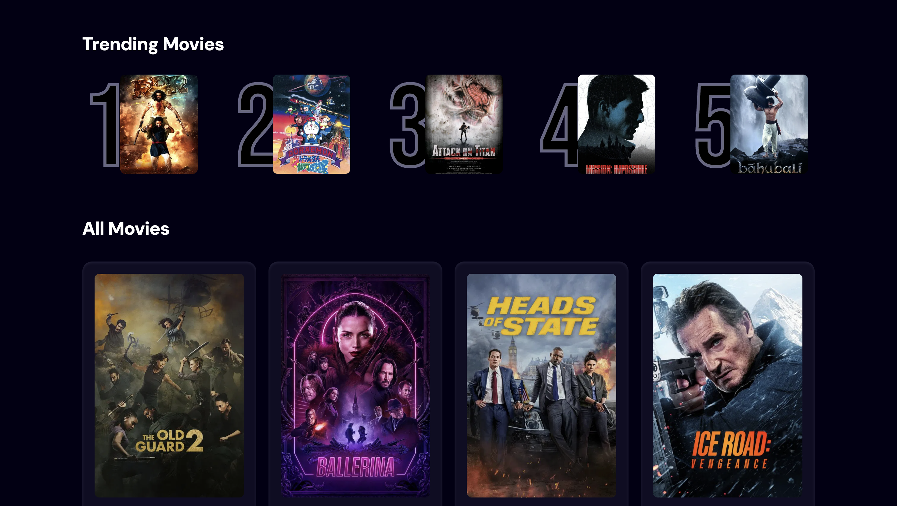
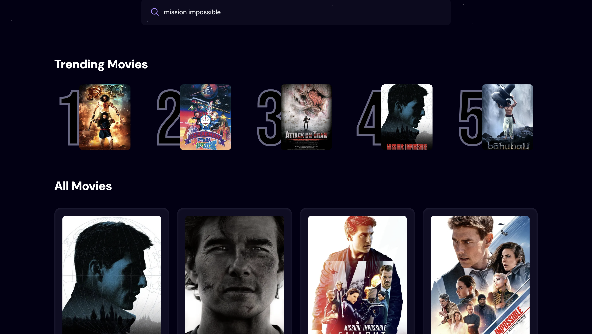

# 🎬 Movie Explorer App

A modern movie browsing application built with React.js and styled with TailwindCSS. This project was created as part of my web development learning journey.

## 📸 Screenshots

### Home Screen


### Trending Movies Section


### Movie Search Results


## Technologies Used

- **React.js** - Frontend framework
- **TailwindCSS** - Styling and responsive design
- **Appwrite** - Backend services for data management
- **TMDB API** - Movie data and information
- **Vite** - Build tool and development server

## Features

- Browse trending movies with dynamic algorithm
- Search functionality for finding specific movies
- Responsive design that works on all devices
- Modern and clean user interface
- Real-time movie data from TMDB API
- User-friendly navigation and experience

## What I Learned

This project helped me understand:
- React hooks and state management
- API integration and data fetching
- Responsive design principles
- Modern CSS with TailwindCSS
- Component-based architecture
- Environment variable management

## Installation & Setup

1. **Clone the repository**
   ```bash
   git clone https://github.com/[Siddharthag2004]/movie-explorer.git
   cd movie-explorer
   ```

2. **Install dependencies**
   ```bash
   npm install
   ```

3. **Set up environment variables**
   
   Create a `.env.local` file in the root directory and add:
   ```env
   VITE_TMDB_API_KEY=your_tmdb_api_key_here
   VITE_APPWRITE_PROJECT_ID=your_appwrite_project_id
   VITE_APPWRITE_DATABASE_ID=your_database_id
   VITE_APPWRITE_COLLECTION_ID=your_collection_id
   ```

4. **Run the development server**
   ```bash
   npm run dev
   ```

5. **Open your browser**
   
   Navigate to `http://localhost:5173` to view the app

## 🔧 Getting API Keys

### TMDB API Key
1. Visit [The Movie Database](https://www.themoviedb.org/)
2. Create an account and request an API key
3. Follow their developer documentation

### Appwrite Setup
1. Go to [Appwrite](https://appwrite.io/)
2. Create a new project
3. Set up your database and collection
4. Get your project credentials

## 📁 Project Structure

```
movie-explorer/
├── public/
│   └── screenshots/
│       ├── home-screen.png
│       ├── trending-movies.png
│       └── search-results.png
├── src/
│   ├── components/
│   │   └── Spinner.jsx
│   ├── styles/
│   │   └── index.css
│   └── App.jsx
├── .env.local
├── package.json
└── README.md
```

## 🎯 Future Improvements

- [ ] Add user authentication and favorites
- [ ] Implement movie details page
- [ ] Add movie reviews and ratings
- [ ] Create watchlist functionality
- [ ] Add movie recommendations
- [ ] Implement dark/light theme toggle

## 🤝 Contributing

This is a learning project, but I'm open to suggestions and improvements! Feel free to:
- Report bugs
- Suggest new features
- Submit pull requests

## 📞 Contact

If you have any questions about this project or want to connect:
- Email: [gurrapusiddhartha2004@gmail.com]
- LinkedIn: [https://www.linkedin.com/in/siddhartha-gurrapu-8b8069263/]
- GitHub: [https://github.com/Siddharthag2004]

## 📄 License

This project is open source and available under the [MIT License](LICENSE).

---

**Note**: This project was created for educational purposes as part of my web development learning journey. The movie data is provided by The Movie Database (TMDB) API.